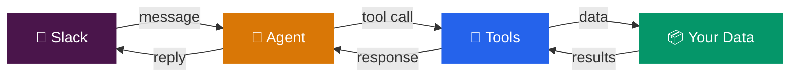
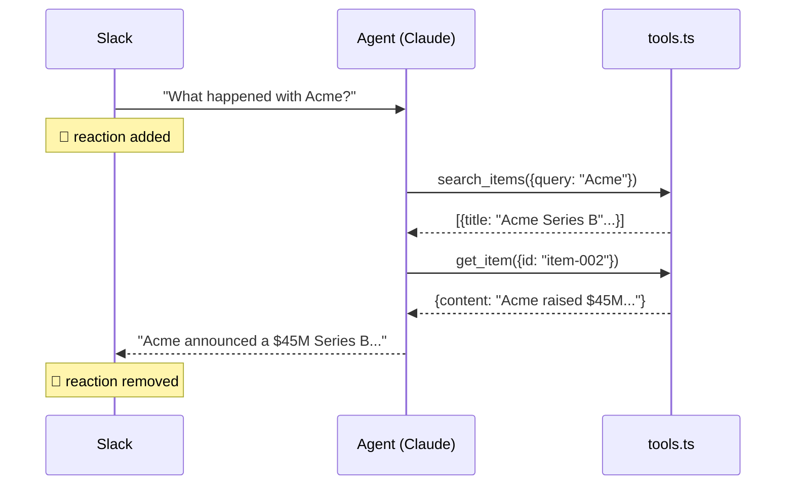
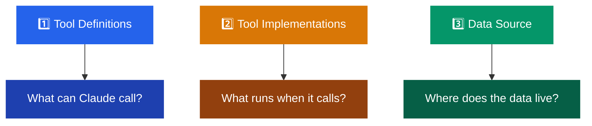
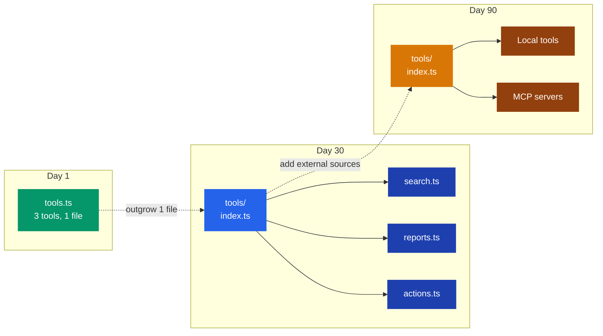
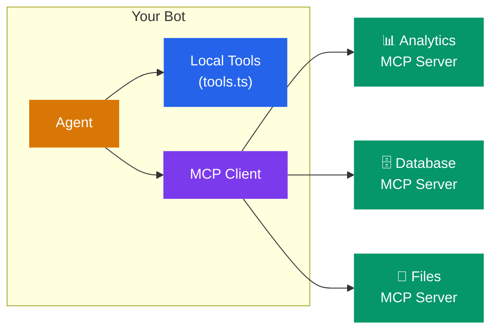
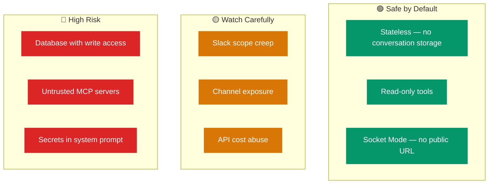

# 🤖 Slack Bot + LLM Starter

> Let people talk to your data through Slack.

```
User: "What's new this week?"
Bot:  "3 items this week — Q1 roadmap update, Acme's Series B,
       and the sales pipeline review..."
```

Clone. Set keys. Run. That's it.

---

## ⚡ How It Works



**4 files, 1 extension point:**

| File | Role |
|------|------|
| `src/slack.ts` | Messages in, replies out |
| `src/agent.ts` | Claude thinks here (tool loop) |
| `src/tools.ts` | **Your tools — edit this first** |
| `src/config.ts` | Env vars and defaults |

---

## 🚀 Setup (10 minutes)

### Prerequisites

- Node.js 20+
- A Slack workspace you can install apps to
- An Anthropic API key

### 1. Create a Slack App

1. Go to [api.slack.com/apps](https://api.slack.com/apps) → **Create New App** → **From Scratch**
2. **Socket Mode** → on → generate app token (`xapp-...`)
3. **OAuth & Permissions** → add bot scopes:
   - `app_mentions:read` · `chat:write` · `channels:history` · `im:history`
4. **Install to Workspace** → copy bot token (`xoxb-...`)
5. **Event Subscriptions** → on → subscribe to:
   - `app_mention` · `message.im`

> **Scope changes?** Reinstall the app. Want private channels? Add `groups:history`.

### 2. Get an Anthropic Key

[console.anthropic.com](https://console.anthropic.com) → create key → add ~$5 credits.

### 3. Clone & Run

```bash
git clone https://github.com/Mikeishiring/slackbot.git && cd slackbot
npm install
cp .env.example .env   # then fill in your tokens
npm start
```

Invite the bot to a channel (`/invite @YourBot`), then `@YourBot what's new?`

<details>
<summary>🤖 <strong>Agent / automated setup</strong> (Claude Code, Cursor, Codex)</summary>

<br/>

1. **Slack App** — use the **App Manifest** JSON editor, not individual pages. Set `socket_mode_enabled: true`, scopes + events in one shot.
2. **Tokens** — app-level token with `connections:write`, bot token from OAuth. Both in `.env`.
3. **Scopes** — add `reactions:write` for the 👀 emoji. Skip `im:history` for channel-only mode.
4. **Railway** — set vars via Raw Editor or GraphQL (`variableCollectionUpsert`), not one-by-one.
5. **Verify** — `npm run check` locally, then push. Railway auto-deploys.
6. **Smoke test** — `@YourBot what's new?` → expect threaded reply with 👀 reaction.

</details>

---

## 🏗️ Architecture

### The Tool Loop

Every message goes through the same cycle:



Claude decides which tools to call and how many times. You define what tools exist.

### Project Structure

```
📁 src/
  ├── index.ts         → Entry point — wires everything together
  ├── config.ts        → Env parsing + defaults
  ├── slack.ts         → Slack connection + thread management
  ├── agent.ts         → Claude API + tool loop
  └── tools.ts         → ⭐ YOUR TOOLS — start here
📁 data/
  └── sample-data.json → Starter dataset (swap this)
📁 test/               → Contract tests
📄 .env.example        → Template for secrets
```

---

## 🔧 Connect Your Data

Open `src/tools.ts`. Three things to change:



**Database:**
```typescript
import postgres from "postgres";
const sql = postgres(process.env.DATABASE_URL);

function searchItems(query: string) {
  return sql`SELECT * FROM items WHERE title ILIKE ${'%' + query + '%'} LIMIT 10`;
}
```

**REST API:**
```typescript
async function searchItems(query: string) {
  const res = await fetch(`https://api.example.com/search?q=${query}`);
  return res.json();
}
```

**MCP Server** — see [Scaling with MCP](#-scaling-with-mcp) below.

---

## 📈 How It Scales



`agent.ts` never changes. It imports `tools` and `runTool` — doesn't matter if that comes from one file or ten.

---

## 🔌 Scaling with MCP

[Model Context Protocol](https://modelcontextprotocol.io) lets you connect external tool servers instead of writing everything in `tools.ts`.



**When to use MCP vs local tools:**

| | Local (`tools.ts`) | MCP Server |
|---|---|---|
| **Best for** | Simple queries, single data source | Complex integrations, shared services |
| **Setup** | Edit one file | Run a server + connect |
| **Trust** | You wrote it | Audit what it exposes |
| **Latency** | Direct | Network hop |

**Start local.** Move to MCP when you have multiple bots sharing the same data source, or when a pre-built MCP server already does what you need.

---

## 💰 Cost

| Component | Monthly |
|-----------|---------|
| Slack | Free |
| Anthropic API | ~$5–50 |
| Railway | ~$5–20 |

Main driver is tokens. Bigger data responses = more tokens per message.

---

## 🔒 Security

Running an LLM in Slack creates new attack surface. Here's the threat model:



### 1. Conversation Storage

By default the bot is **stateless** — no database, no logs. Deploy on Railway with just the LLM and **no conversation data is stored** beyond Slack itself and Anthropic's [data retention policy](https://www.anthropic.com/policies).

Add a database? Now you're storing conversations. Think encryption, retention, access controls.

### 2. Slack Scope Discipline

Every scope is an attack surface. Ship with the minimum:

| Scope | Risk | Guidance |
|-------|------|----------|
| `chat:write` | Low | Required |
| `channels:history` | Medium | Only invited channels |
| `files:write` | **High** | Add only if needed |
| `admin.*` | **Critical** | Never give to a bot |

### 3. Channel & Tool Scoping

- **Channel allowlist** — check `event.channel` in `slack.ts`
- **Read-only tools first** — write tools behind confirmation
- **User allowlist** — restrict who can trigger the bot

> `search_items` is safe. `delete_items` or `run_sql` is a loaded gun.

### 4. Third-Party & MCP Trust

- Only connect MCP servers **you control or trust**
- Audit tool lists before connecting (`client.listTools()`)
- Run MCP in the same private network — not public internet
- **Local tools first** — don't add MCP when `tools.ts` works fine

### 5. Prompt Injection

**An LLM is not a security boundary.** If you give the bot a database connection, assume a skilled user can extract any reachable data.

- Keep tools **read-only** — injection is harmless if worst case is a search
- **Don't put secrets in the system prompt** — assume it can be extracted
- **Validate tool inputs** in `runTool()` — don't trust Claude's parameters blindly
- **Scope database credentials** — read-only replica, row-level security
- **Enforce access at the data layer**, never at the prompt layer

### 6. Keys & Rate Limiting

- Never commit `.env` (gitignored by default)
- Use platform secrets (Railway env vars) in production
- Set [spend caps](https://console.anthropic.com) — no built-in rate limiting
- Consider per-user cooldowns if the bot is public

**TL;DR:** Ship read-only, scope tight, don't store what you don't need, vet every MCP server like a dependency.

---

## 🚂 Deploy

```bash
npm start   # local
```

**Railway:** Push to GitHub → New Project → Deploy from GitHub → add env vars → done.

**Other hosts:** Fly.io, Render, DigitalOcean, Docker — anything that runs `npm start`.

No public URL needed — Socket Mode connects outbound.

---

## ⚙️ Environment Variables

| Variable | Required | Default |
|----------|----------|---------|
| `SLACK_BOT_TOKEN` | Yes | — |
| `SLACK_APP_TOKEN` | Yes | — |
| `ANTHROPIC_API_KEY` | Yes | — |
| `ANTHROPIC_MODEL` | No | `claude-opus-4-20250918` |
| `ANTHROPIC_REQUEST_TIMEOUT_MS` | No | `15000` |
| `ANTHROPIC_MAX_RETRIES` | No | `2` |

---

## 📝 Notes

This repo is intentionally small. The only file you need to touch is `src/tools.ts` — swap the sample JSON for your database, API, or MCP server and ship it.
