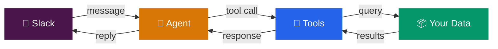
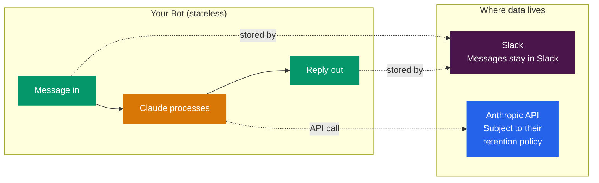
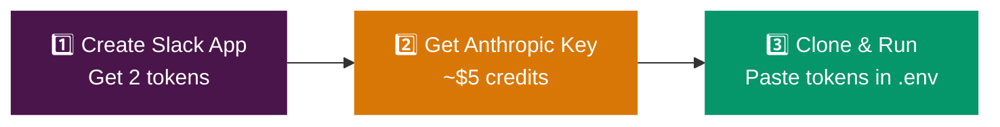
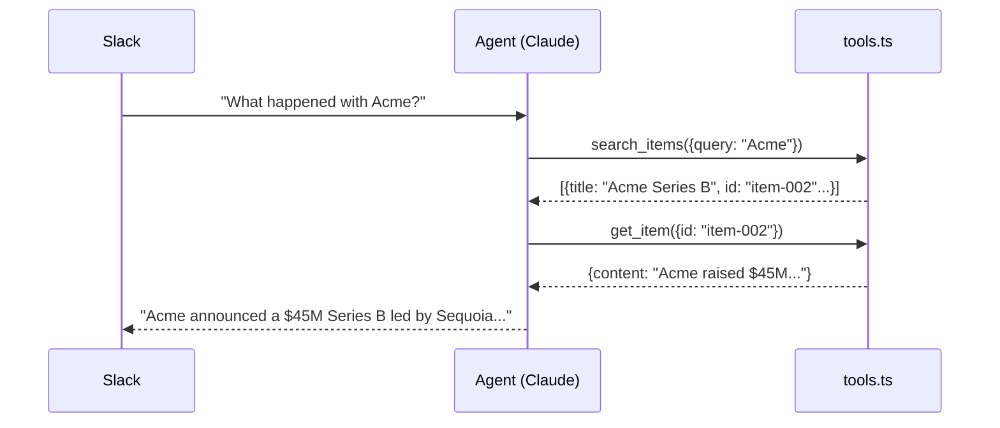
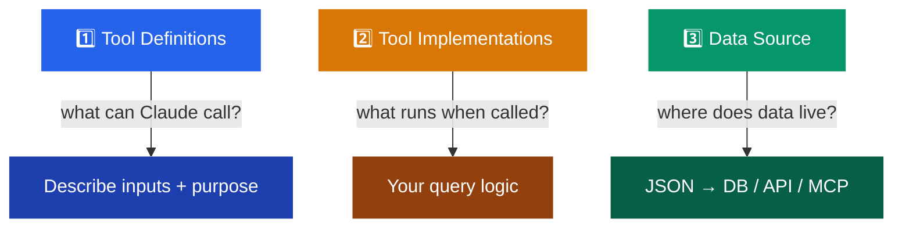
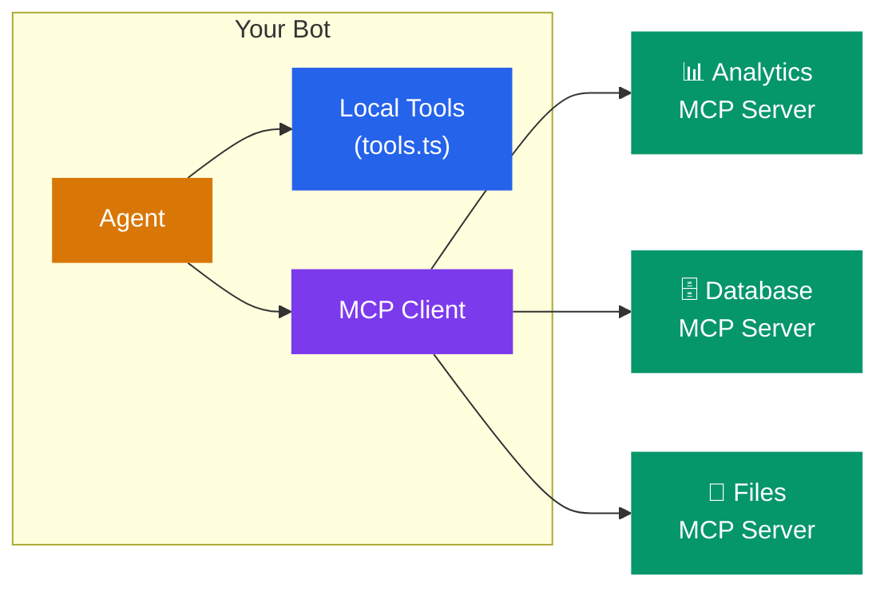
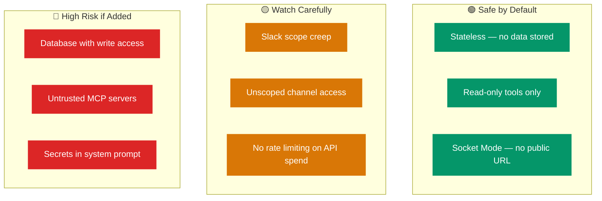

# 🤖 Slack Bot + LLM Starter

> Give your team an AI teammate that answers questions from your data — right inside Slack.

```
User: "What's new this week?"
Bot:  "3 items this week — Q1 roadmap update, Acme's Series B,
       and the sales pipeline review..."
```

Clone. Set 3 keys. Run. That's it.

---

## ⚡ How It Works



Someone messages your bot in Slack. Claude reads the message, decides which tools to call, gets data back, and replies in the thread. You control what tools exist.

**4 files, 1 extension point:**

| File | What it does |
|------|-------------|
| `src/slack.ts` | Receives messages, posts replies |
| `src/agent.ts` | Claude API + tool loop |
| `src/tools.ts` | **Your tools — edit this first** |
| `src/config.ts` | Environment variables + defaults |

---

## 🔒 Before You Start — What Gets Stored?



**By default, this bot stores nothing.** No database, no logs, no conversation history. Messages live in Slack. API calls go to Anthropic (see their [data retention policy](https://www.anthropic.com/policies)). That's it.

If you add a database later, you're now storing conversations — think about encryption, retention, and access controls before you do.

---

## 🚀 Setup

You need **3 things**: a Slack app, an Anthropic key, and this repo.



### Step 1: Create a Slack App

1. Go to [api.slack.com/apps](https://api.slack.com/apps) → **Create New App** → **From Scratch**
2. Name it whatever you want, pick your workspace
3. **Socket Mode** → toggle on → generate an app token (starts with `xapp-`)
4. **OAuth & Permissions** → add bot scopes:
   - `app_mentions:read` — see when someone @mentions the bot
   - `chat:write` — post replies
   - `channels:history` — read thread history for context
   - `im:history` — read DMs *(skip this for channel-only mode)*
5. **Install to Workspace** → copy the bot token (starts with `xoxb-`)
6. **Event Subscriptions** → toggle on → subscribe to:
   - `app_mention` — someone @mentions the bot
   - `message.im` — someone DMs the bot *(skip for channel-only)*

> **Changed scopes or events?** Reinstall the app to the workspace.
> **Want private channels?** Add `groups:history`, reinstall, and invite the bot.

### Step 2: Get an Anthropic Key

1. Go to [console.anthropic.com](https://console.anthropic.com)
2. Create an API key
3. Add credits (~$5 is plenty to start)
4. **Set a monthly spend cap** — there's no built-in rate limiting in the bot

### Step 3: Clone & Run

```bash
git clone https://github.com/Mikeishiring/slackbot.git && cd slackbot
npm install
cp .env.example .env   # then paste your 3 tokens
npm start
```

<details>
<summary>Windows PowerShell</summary>

```powershell
Copy-Item .env.example .env
npm install
npm start
```

</details>

### Step 4: Test It

1. Invite the bot to a channel: `/invite @YourBotName`
2. Send: `@YourBotName what's new this week?`
3. Also try a DM — just message the bot directly

Expected: the bot replies in a thread with information from the sample dataset.

`npm run check` runs both linting and tests locally.

<details>
<summary>🤖 <strong>Agent / automated setup</strong> (Claude Code, Cursor, Codex)</summary>

<br/>

1. **Slack App** — use the **App Manifest** JSON editor (`Settings → App Manifests`), not individual pages. Set `socket_mode_enabled: true`, scopes + events in one shot.
2. **Tokens** — app-level token with `connections:write`, bot token from OAuth. Both in `.env`.
3. **Scopes** — add `reactions:write` if you implement the 👀 processing indicator. Skip `im:history` for channel-only mode.
4. **Railway** — set vars via Raw Editor or GraphQL (`variableCollectionUpsert`), not one-by-one.
5. **Verify** — `npm run check` locally, then push. Railway auto-deploys.

</details>

---

## 🏗️ Architecture

### Project Structure

```
📁 src/
  ├── index.ts         → Entry point — wires everything together
  ├── config.ts        → Env vars, defaults, validation
  ├── slack.ts         → Socket Mode connection + thread history
  ├── agent.ts         → Claude API + tool loop (max 10 calls)
  └── tools.ts         → ⭐ YOUR TOOLS — start here
📁 data/
  └── sample-data.json → Starter dataset (swap this out)
📁 test/               → Contract tests for all 4 modules
📄 .env.example        → Template — copy to .env and fill in
```

### The Tool Loop

Here's exactly what happens when someone messages your bot:



Claude decides which tools to call, how many times (up to 10), and how to summarize the results. You define what tools exist and what data they return.

### What's Included

The starter ships with 3 read-only tools against a sample JSON file:

| Tool | What it does |
|------|-------------|
| `search_items` | Keyword search with optional tag filter |
| `get_item` | Full details for one item by ID |
| `list_recent` | Most recent items (default: last 7 days) |

---

## 🔧 Connect Your Data

Open `src/tools.ts` — three things to change:



**Swap the JSON file for a database:**
```typescript
import postgres from "postgres";
const sql = postgres(process.env.DATABASE_URL);

function searchItems(query: string) {
  return sql`SELECT * FROM items WHERE title ILIKE ${'%' + query + '%'} LIMIT 10`;
}
```

**Or call a REST API:**
```typescript
async function searchItems(query: string) {
  const res = await fetch(`https://api.example.com/search?q=${query}`);
  return res.json();
}
```

---

## 📈 How It Scales


`agent.ts` never changes. It imports `tools` and `runTool` — doesn't matter if that's one file or ten.

---

## 🔌 Scaling with MCP

[Model Context Protocol](https://modelcontextprotocol.io) lets you connect external tool servers instead of writing everything in `tools.ts`.



| | Local (`tools.ts`) | MCP Server |
|---|---|---|
| **Best for** | Simple queries, single data source | Shared services, pre-built integrations |
| **Setup** | Edit one file | Run a server + connect |
| **Trust** | You wrote it | Audit what it exposes |

**Start local.** Move to MCP when you need multiple bots on the same data, or a pre-built server already does what you need.

---

## 🛡️ Security

Running an LLM in Slack creates new attack surface. Here's the threat model:



### Slack Scope Discipline

Every OAuth scope is an attack surface. Ship with the minimum:

| Scope | Risk | Guidance |
|-------|------|----------|
| `chat:write` | Low | Required — bot replies |
| `channels:history` | Medium | Only channels bot is invited to |
| `files:write` | **High** | Add only if a tool needs it |
| `admin.*` | **Critical** | Never give to a bot |

### Channel & Tool Scoping

- **Channel allowlist** — check `event.channel` in `slack.ts` to restrict where the bot responds
- **Read-only tools first** — write tools should require confirmation
- **User allowlist** — restrict who can trigger the bot if needed

> `search_items` is safe. `delete_items` or `run_sql` is a loaded gun.

### Third-Party & MCP Trust

- Only connect MCP servers **you control or trust** — a malicious server can inject prompts via tool results
- Audit tool lists before connecting (`client.listTools()`)
- Run MCP in the same private network — not on the public internet
- **Local tools first** — don't add an MCP dependency when `tools.ts` works fine

### Prompt Injection

**An LLM is not a security boundary.** If you give the bot a database connection, assume a skilled user can extract any data reachable by that connection. "Never return PII" in a system prompt is a guideline, not a guardrail — it can be bypassed.

- Keep tools **read-only** — limits damage even if injection succeeds
- **Don't put secrets in the system prompt** — assume it can be extracted
- **Validate tool inputs** in `runTool()` — don't blindly trust Claude's parameters
- **Scope database credentials** — read-only replica, row-level security
- **Enforce access at the data layer**, never at the prompt layer

### Keys & Cost

- Never commit `.env` (gitignored by default)
- Use platform secrets (Railway env vars) in production
- **Set a spend cap** in the [Anthropic Console](https://console.anthropic.com) — there's no built-in rate limiting
- Consider per-user cooldowns if the bot is widely accessible

---

## 🚂 Deploy

```bash
npm start   # local development
```

**Railway** (recommended): Push to GitHub → New Project → Deploy from GitHub → add env vars → done. Logs should show `Bot is running (Socket Mode)`.

**Other hosts:** Fly.io, Render, DigitalOcean, Docker — anything that runs `npm start` and stays alive. No public URL needed.

---

## ⚙️ Environment Variables

| Variable | Required | Default |
|----------|----------|---------|
| `SLACK_BOT_TOKEN` | Yes | — |
| `SLACK_APP_TOKEN` | Yes | — |
| `ANTHROPIC_API_KEY` | Yes | — |
| `ANTHROPIC_MODEL` | No | `claude-opus-4-20250918` |
| `ANTHROPIC_REQUEST_TIMEOUT_MS` | No | `15000` |
| `ANTHROPIC_MAX_RETRIES` | No | `2` |

---

## 💰 Cost

| Component | Monthly cost |
|-----------|-------------|
| Slack | Free |
| Anthropic API | ~$5–50 depending on usage |
| Railway | ~$5–20 |

**What drives cost:** Every message = one or more API calls. Longer tool responses and deeper threads use more tokens. A team of 10 with moderate usage runs ~$10–20/month.

---

## 🔧 Troubleshooting

| Problem | Fix |
|---------|-----|
| Bot doesn't respond | Check scopes + event subscriptions. Reinstall app after changes. |
| `Bot is running` but no replies | Invite the bot: `/invite @YourBotName` |
| `not_found_error` on model | Check `ANTHROPIC_MODEL` — use a valid model ID |
| Socket keeps disconnecting | Check `SLACK_APP_TOKEN` starts with `xapp-` |
| High API costs | Set spend cap in Anthropic Console. Reduce tool response sizes. |
| `Missing required environment variable` | Check `.env` has all 3 required vars filled in |

---

## 📝 Notes

This repo is intentionally small. The only file you need to change is `src/tools.ts` — swap the sample JSON for your database, API, or MCP server and ship it.
