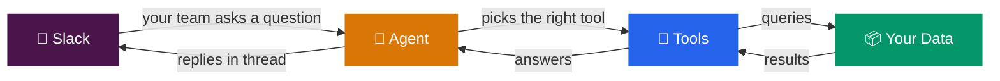
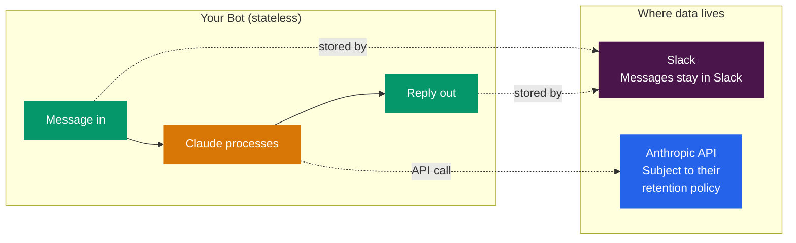
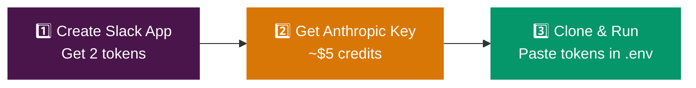
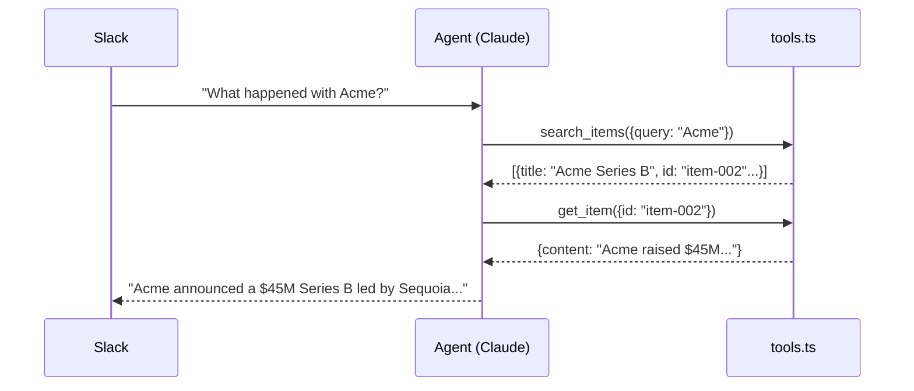
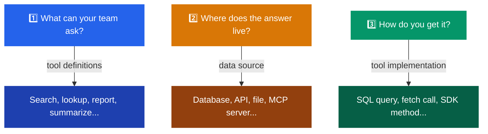
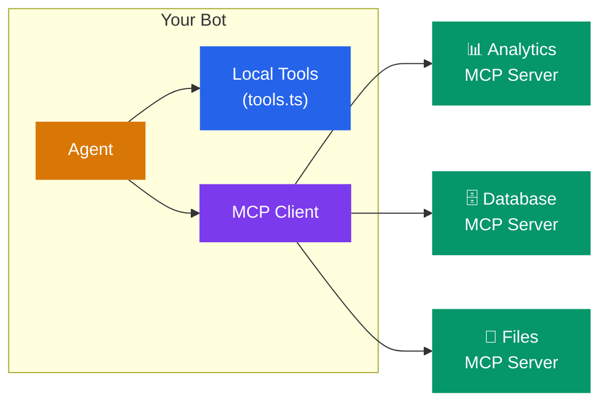
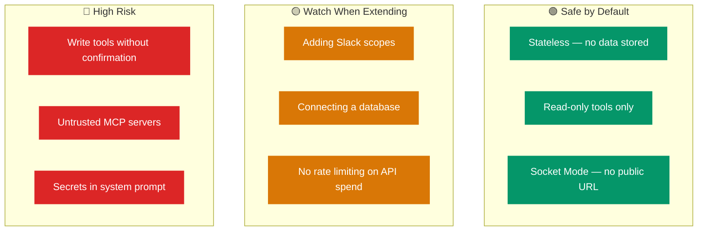

# 🤖 Slack Bot LLM Starter

> Let your team talk to your data, tools, and apps — directly from Slack.

```
User: "What's new this week?"
Bot:  "3 items this week — Q1 roadmap update, Acme's Series B,
       and the sales pipeline review..."
```

Connect it to a database, an API, an internal tool — whatever your team needs to query. They just ask the bot in plain English.

Clone. Set 3 keys. Run.

---

## ✨ What You Get

- **Word-overlap search** — natural queries like "series b funding" find the right items, not just exact substrings. Title matches rank higher.
- **👀 Processing indicator** — the bot reacts with :eyes: when it receives your message, removes it when the reply lands. Your team knows it's working.
- **Thread context** — follow-up questions work naturally. The bot reads thread history before responding.
- **Tool loop** — Claude picks the right tool, reads the results, and replies. Up to 10 tool calls per message.
- **Single config source** — model, timeout, and retry defaults live in one place. No drift between files.

---

## ⚡ How It Works



Someone messages your bot. Claude figures out what they're asking, calls the right tool, gets data back, and replies in the thread. You decide what tools exist and what data they can access.

**4 files, 1 extension point:**

| File | What it does |
|------|-------------|
| `src/slack.ts` | Receives messages, posts replies |
| `src/agent.ts` | Claude API + tool loop |
| `src/tools.ts` | **Your tools — the one file you customize** |
| `src/config.ts` | Environment variables + defaults |

---

## 🔒 Before You Start — What Gets Stored?



**Out of the box, this bot stores nothing.** No database, no logs, no conversation history. Messages live in Slack. API calls go to Anthropic (see their [data retention policy](https://www.anthropic.com/policies)).

> **If you add things — a database, an MCP server, a third-party API — those things can store data.** That's where you need to be careful. Each integration you add is a new place where conversations or query results might be logged, cached, or persisted. See [Security](#-security) for what to watch for.

---

## 🚀 Setup

You need **3 things**: a Slack app, an Anthropic key, and this repo.



### Step 1: Create a Slack App

1. Go to [api.slack.com/apps](https://api.slack.com/apps) → **Create New App** → **From Scratch**
2. Name it whatever you want, pick your workspace
3. **Socket Mode** → toggle on → generate an app token (starts with `xapp-`)
4. **OAuth & Permissions** → add bot scopes:
   - `app_mentions:read` — see when someone @mentions the bot
   - `chat:write` — post replies
   - `channels:history` — read thread history for context
   - `reactions:write` — add/remove the 👀 processing indicator
   - `im:history` — read DMs *(skip this for channel-only mode)*
5. **Install to Workspace** → copy the bot token (starts with `xoxb-`)
6. **Event Subscriptions** → toggle on → subscribe to:
   - `app_mention` — someone @mentions the bot
   - `message.im` — someone DMs the bot *(skip for channel-only)*

> **Changed scopes or events?** Reinstall the app to the workspace.
> **Want private channels?** Add `groups:history`, reinstall, and invite the bot.

### Step 2: Get an Anthropic Key

1. Go to [console.anthropic.com](https://console.anthropic.com)
2. Create an API key
3. Add credits (~$5 is plenty to start)
4. **Set a monthly spend cap** — there's no built-in rate limiting in the bot

### Step 3: Clone & Run

```bash
git clone https://github.com/Mikeishiring/slackbot.git && cd slackbot
npm install
cp .env.example .env   # then paste your 3 tokens
npm start
```

<details>
<summary>Windows PowerShell</summary>

```powershell
Copy-Item .env.example .env
npm install
npm start
```

</details>

**Not technical?** You can skip the terminal entirely. Install the [Claude Code](https://docs.anthropic.com/en/docs/claude-code) CLI with the Chrome extension, open this repo, and ask Claude to set everything up for you — Slack app, Anthropic key, Railway deployment, all of it. It can use your browser to click through the setup pages autonomously.

### Step 4: Test It

1. Invite the bot to a channel: `/invite @YourBotName`
2. Send: `@YourBotName what's new this week?`
3. Try a DM too — just message the bot directly

Expected: the bot replies in a thread using the sample dataset.

`npm run check` runs linting and tests locally.

<details>
<summary>🤖 <strong>Agent / automated setup</strong> (Claude Code, Cursor, Codex)</summary>

<br/>

If you're using an AI coding agent to set this up:

1. **Slack App** — use the **App Manifest** JSON editor (`Settings → App Manifests`), not individual pages. Set `socket_mode_enabled: true`, scopes + events in one shot.
2. **Tokens** — app-level token with `connections:write`, bot token from OAuth. Both in `.env`.
3. **Scopes** — `reactions:write` is included by default for the 👀 processing indicator. Skip `im:history` for channel-only mode.
4. **Railway** — set vars via Raw Editor or GraphQL (`variableCollectionUpsert`), not one-by-one.
5. **Verify** — `npm run check` locally, then push. Railway auto-deploys.

</details>

---

## 🏗️ Architecture

### Project Structure

```
📁 src/
  ├── index.ts         → Entry point — wires everything together
  ├── config.ts        → Env vars, defaults, validation
  ├── slack.ts         → Socket Mode connection + thread history
  ├── agent.ts         → Claude API + tool loop (max 10 calls)
  └── tools.ts         → ⭐ YOUR TOOLS — start here
📁 data/
  └── sample-data.json → Starter dataset (swap this out)
📁 test/               → Contract tests for all 4 modules
📄 .env.example        → Template — copy to .env and fill in
```

### The Tool Loop

Here's what happens every time someone messages your bot:



Claude decides which tools to call, how many times (up to 10), and how to phrase the answer. You define what tools exist and what data they return.

### What's Included

The starter ships with 3 read-only tools against a sample JSON file:

| Tool | What it does |
|------|-------------|
| `search_items` | Keyword search with optional tag filter |
| `get_item` | Full details for one item by ID |
| `list_recent` | Most recent items (default: last 7 days) |

---

## 🔧 Connect Your Data

This is where you make it yours. The bot can talk to anything — a database, a REST API, an internal tool, a spreadsheet, a CRM. You're really just answering three questions:



Open `src/tools.ts` and swap the sample data for your real source.

**Connect a database:**
```typescript
import postgres from "postgres";
const sql = postgres(process.env.DATABASE_URL);

function searchItems(query: string) {
  return sql`SELECT * FROM items WHERE title ILIKE ${'%' + query + '%'} LIMIT 10`;
}
```

**Call a REST API:**
```typescript
async function searchItems(query: string) {
  const res = await fetch(`https://api.example.com/search?q=${query}`);
  return res.json();
}
```

**Some ideas:** connect it to your CRM so the team can ask "what deals closed this week?", hook it up to your analytics API for "how's traffic looking?", or point it at an internal wiki so people can ask "what's our refund policy?" — anything your team currently has to go dig for manually.

---

## 📈 How It Scales

You start with one file and three tools. As you add more, the structure grows with you:


The key thing: `agent.ts` never changes. It imports `tools` and `runTool` from whatever you give it — one file, a folder of files, or a mix of local tools and external MCP servers. You can keep adding capabilities without touching the core.

When you outgrow a single file, split `tools.ts` into a `tools/` folder. When you want to connect external services, add MCP servers alongside your local tools. The bot doesn't care where the tools come from.

---

## 🔌 Scaling with MCP

[Model Context Protocol](https://modelcontextprotocol.io) lets you plug in external tool servers instead of coding everything in `tools.ts`. Think of it like adding plugins.



| | Local (`tools.ts`) | MCP Server |
|---|---|---|
| **Best for** | Simple queries, single data source | Shared services, pre-built integrations |
| **Setup** | Edit one file | Run a server + connect |
| **Trust** | You wrote it | Audit what it exposes |

**Start local.** Move to MCP when you need multiple bots sharing the same data, or when a pre-built MCP server already does what you need.

---

## 🛡️ Security

Read this before deploying. This bot runs code that has the Slack permissions you granted it.

### What the bot can do with its current permissions

| Scope | What it allows |
|-------|---------------|
| `app_mentions:read` | Read any message that @mentions the bot |
| `chat:write` | Post messages to any channel the bot is in |
| `channels:history` | Read message history in public channels the bot is in |
| `reactions:write` | Add/remove emoji reactions (used for 👀 processing indicator) |

That's it. The bot ships with these scopes and nothing more.

### The trust model

When you deploy this bot, you're trusting three things:

**The code in this repo.** `tools.ts` defines what the bot actually does. Anyone with write access to the repo or the deployment can change what happens when the bot is mentioned. A malicious change to `tools.ts` could make the bot read channel history and exfiltrate it, post misleading messages, or misuse the Slack API. Audit `tools.ts` before deploying — it's the only file that should change.

**The Anthropic API.** Claude processes your Slack messages. Anything said to the bot goes through Anthropic's API. Review their [data usage policy](https://www.anthropic.com/policies).

**Your deployment platform.** Whoever has access to your Railway/hosting environment can see your tokens and modify the running code.

### What this bot does NOT do

- It does **not** read DMs (no `im:history` scope)
- It does **not** access private channels (no `groups:history` scope)
- It does **not** manage channels, users, or workspace settings
- It does **not** store messages — thread history is fetched on demand and discarded after the response
- It does **not** have a database — it's completely stateless

### Recommendations



**1. Audit `tools.ts` before deploying.** It's the only file that should change. If you see modifications to `slack.ts`, `agent.ts`, or `index.ts` in a PR, understand why before merging.

**2. Limit channel access.** Only invite the bot to channels where you want it. It can only read history in channels it's been invited to.

**3. Use minimal scopes.** This bot intentionally does not request `im:history` (DMs) or `groups:history` (private channels). If you don't need a scope, don't add it. Security here is about omission — you secure it by not granting access, not by configuring something extra.

**4. Rotate tokens if you suspect compromise.** Revoke and regenerate both the bot token and app token from [api.slack.com/apps](https://api.slack.com/apps).

**5. Pin your dependencies.** Run `npm audit` before deploying. Supply chain attacks through npm packages are a real vector.

**6. Keep the Anthropic API key scoped.** Use a dedicated key for this bot, not your org-wide key. Set a [monthly spend cap](https://console.anthropic.com) — there's no built-in rate limiting.

### If you connect a database

**An LLM is not a security boundary.** If you give the bot a database connection, assume a skilled user can get Claude to query anything that connection can reach. System prompt instructions like "never return PII" are suggestions, not walls — they can be bypassed through prompt injection.

This isn't a flaw — it's how LLMs work. Plan for it:

- Keep tools **read-only** — if the worst case is a search query, injection is harmless
- **Scope your credentials** — read-only replica, only the tables the bot needs, row-level security
- **Don't put secrets in the system prompt** — assume it can be extracted
- **Validate tool inputs** in `runTool()` — don't blindly trust what Claude passes in
- **Enforce access at the data layer** (row-level security, view permissions), never at the prompt layer

### If you connect MCP servers

MCP servers are powerful — and that's the risk. When you connect one, you're giving Claude access to whatever that server exposes.

- Only connect servers **you control or trust** — a malicious server can inject prompts through tool results
- **Audit tool lists** before connecting (`client.listTools()`)
- Run MCP servers in the same private network as the bot — not on the public internet
- **If you can do it in `tools.ts`, do it there** — don't add an external dependency you don't need

### TL;DR

Ship read-only, scope tight, don't store what you don't need. Audit `tools.ts` before every deploy. Treat every MCP server and database connection like a dependency — vet it before you trust it.

---

## 🚂 Deploy

**Locally:**
```bash
npm start
```

**Railway** (recommended): Push to GitHub → New Project → Deploy from GitHub → add env vars → done. Logs should show `Bot is running (Socket Mode)`.

**Other hosts:** Fly.io, Render, DigitalOcean, Docker — anything that runs `npm start` and stays alive. No public URL needed — Socket Mode connects outbound.

**Not technical?** Use [Claude Code](https://docs.anthropic.com/en/docs/claude-code) with the Chrome extension to deploy for you. Ask it to create a Railway project, set your environment variables, and push — it can handle the entire deployment through your browser.

---

## ⚙️ Environment Variables

| Variable | Required | Default |
|----------|----------|---------|
| `SLACK_BOT_TOKEN` | Yes | — |
| `SLACK_APP_TOKEN` | Yes | — |
| `ANTHROPIC_API_KEY` | Yes | — |
| `ANTHROPIC_MODEL` | No | `claude-opus-4-20250918` |
| `ANTHROPIC_REQUEST_TIMEOUT_MS` | No | `15000` |
| `ANTHROPIC_MAX_RETRIES` | No | `2` |

---

## 💰 Cost

| Component | Monthly cost |
|-----------|-------------|
| Slack | Free |
| Anthropic API | ~$5–50 depending on usage |
| Railway | ~$5–20 |

**What drives cost:** Every message is one or more API calls. Longer tool responses and deeper threads use more tokens. A team of 10 with moderate usage runs about $10–20/month.

---

## 🔧 Troubleshooting

| Problem | Fix |
|---------|-----|
| Bot doesn't respond | Check scopes + event subscriptions. Reinstall app after changes. |
| `Bot is running` but no replies | Invite the bot: `/invite @YourBotName` |
| `not_found_error` on model | Check `ANTHROPIC_MODEL` is a valid model ID |
| Socket keeps disconnecting | Check `SLACK_APP_TOKEN` starts with `xapp-` |
| High API costs | Set spend cap in Anthropic Console. Reduce tool response sizes. |
| `Missing required environment variable` | Check `.env` has all 3 required vars filled in |

---

## 📝 Notes

This repo is intentionally small. The only file you need to change is `src/tools.ts` — swap the sample JSON for your database, API, or MCP server and ship it.
