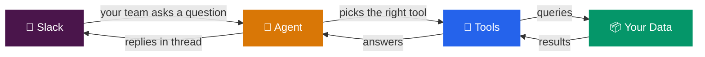
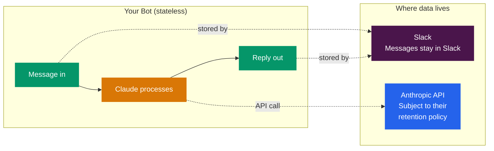
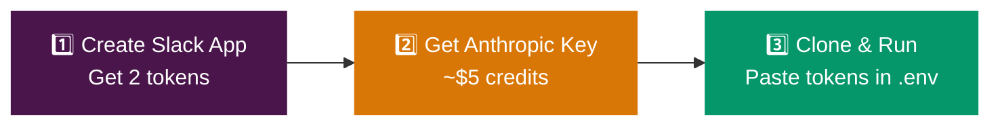
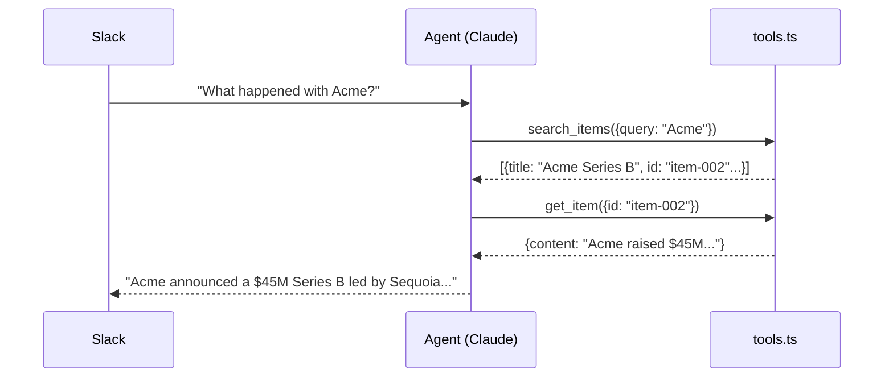
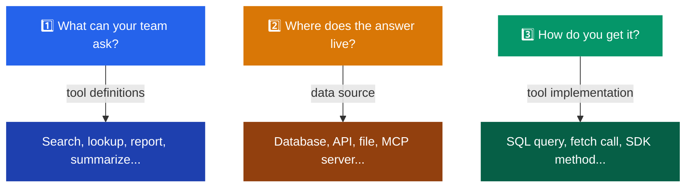
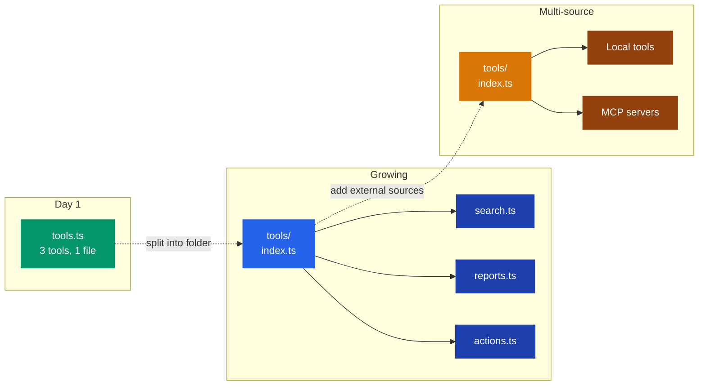
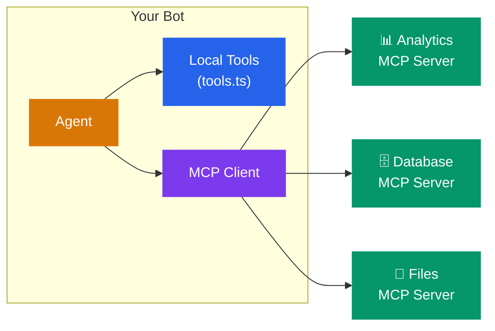
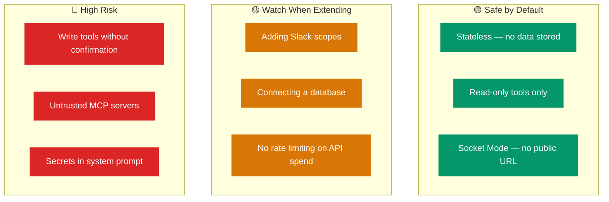

# 🤖 Slack Bot LLM Starter

> Let your team talk to your data, tools, and apps — directly from Slack.

```
User: "What's new this week?"
Bot:  "3 items this week — Q1 roadmap update, Acme's Series B,
       and the sales pipeline review..."
```

Connect it to a database, an API, an internal tool — whatever your team needs to query. They just ask the bot in plain English.

Clone. Set 3 keys. Run.

---

## ✨ What You Get

- **Word-overlap search** — natural queries like "series b funding" find the right items, not just exact substrings. Title matches rank higher.
- **👀 Processing indicator + streaming replies** — the bot reacts with :eyes: the instant your message arrives, posts a placeholder reply, then streams Claude's text into it as it's generated. Two signals: "I see you" and "answer forming now."
- **Thread context** — follow-up questions work naturally. The bot reads the most recent thread history before responding, and correctly tells its own past replies apart from other bots' messages.
- **Tool loop** — Claude picks the right tool, reads the results, and replies. Up to 10 model turns per message, with oversized tool payloads truncated so one big result can't crowd out the conversation.
- **Slack-safe formatting** — markdown is translated to Slack's dialect, and code spans and fenced blocks pass through untouched so `**pointers**` and `x ** 2` survive intact.
- **Long-response chunking** — answers longer than Slack's 3,500-char message limit auto-split on paragraph boundaries and post as a chain of replies in the same thread.
- **Duplicate-event protection** — Slack redelivers events when a socket reconnects. Repeats are dropped instead of producing a second reply.
- **Clean shutdown** — SIGTERM/SIGINT close the socket before exiting, so a redeploy doesn't strand an in-flight message.
- **Optional channel allowlist** — set `SLACK_ALLOWED_CHANNELS` to restrict @-mention responses to specific channels (DMs always allowed). Defense against accidental exposure if the bot is invited somewhere unexpected.
- **Single config source** — model, timeout, and retry defaults live in one place. No drift between files.

---

## ⚡ How It Works


```mermaid
graph LR
    A["💬 Slack"] -->|"your team asks a question"| B["🧠 Agent"]
    B -->|"picks the right tool"| C["🔧 Tools"]
    C -->|"queries"| D["📦 Your Data"]
    D -->|"results"| C
    C -->|"answers"| B
    B -->|"replies in thread"| A

    style A fill:#4A154B,color:#fff,stroke:#4A154B
    style B fill:#D97706,color:#fff,stroke:#D97706
    style C fill:#2563EB,color:#fff,stroke:#2563EB
    style D fill:#059669,color:#fff,stroke:#059669
```

Someone messages your bot. Claude figures out what they're asking, calls the right tool, gets data back, and replies in the thread. You decide what tools exist and what data they can access.

**Six files. Two are yours:**

| File | What it does |
|------|-------------|
| `src/tools.ts` | **Yours** — your data and what the team can ask for. Start here. |
| `src/index.ts` | **Yours** — wiring and policy: persona, shutdown, extra Slack handlers. |
| `src/slack.ts` | The machine: Socket Mode, threads, streaming, chunking |
| `src/agent.ts` | The machine: Claude loop, contracts, model invariants |
| `src/format.ts` | The machine: markdown → Slack mrkdwn |
| `src/config.ts` | The machine: env parsing + exported defaults |

Everything the bot can *do* is defined in the two files marked yours. That's also the review rule: a diff touching the other four deserves a second look.

---

## 🔒 Before You Start — What Gets Stored?


```mermaid
graph LR
    subgraph "Your Bot (stateless)"
        A["Message in"] --> B["Claude processes"] --> C["Reply out"]
    end

    subgraph "Where data lives"
        D["Slack<br/>Messages stay in Slack"]
        E["Anthropic API<br/>Subject to their<br/>retention policy"]
    end

    B -.->|"API call"| E
    A -.->|"stored by"| D
    C -.->|"stored by"| D

    style A fill:#059669,color:#fff,stroke:none
    style B fill:#D97706,color:#fff,stroke:none
    style C fill:#059669,color:#fff,stroke:none
    style D fill:#4A154B,color:#fff,stroke:none
    style E fill:#2563EB,color:#fff,stroke:none
```

**Out of the box, this bot stores nothing.** No database, no logs, no conversation history. Messages live in Slack. API calls go to Anthropic (see their [data retention policy](https://www.anthropic.com/policies)).

> **If you add things — a database, an MCP server, a third-party API — those things can store data.** That's where you need to be careful. Each integration you add is a new place where conversations or query results might be logged, cached, or persisted. See [Security](#-security) for what to watch for.

---

## 🚀 Setup

You need **3 things**: a Slack app, an Anthropic key, and this repo.


```mermaid
graph LR
    A["1️⃣ Create Slack App<br/>Get 2 tokens"] --> B["2️⃣ Get Anthropic Key<br/>~$5 credits"]
    B --> C["3️⃣ Clone & Run<br/>Paste tokens in .env"]

    style A fill:#4A154B,color:#fff,stroke:none
    style B fill:#D97706,color:#fff,stroke:none
    style C fill:#059669,color:#fff,stroke:none
```

### Step 1: Create a Slack App

1. Go to [api.slack.com/apps](https://api.slack.com/apps) → **Create New App** → **From a manifest**
2. Pick your workspace, then paste the contents of [`manifest.json`](manifest.json)
3. **Basic Information** → **App-Level Tokens** → generate one with `connections:write` (starts with `xapp-`)
4. **Install to Workspace** → copy the bot token (starts with `xoxb-`)

That's it — the manifest sets Socket Mode, all five scopes, and both events in one shot. `manifest.json` is the source of truth for what the bot can read; see [Security](#-security) for what each scope allows.

> **Changed scopes or events?** Reinstall the app to the workspace.
> **Channel-only (no DMs)?** Remove `im:history` and `message.im` from the manifest before pasting.
> **Want private channels?** Add `groups:history`, reinstall, and invite the bot.

### Step 2: Get an Anthropic Key

1. Go to [console.anthropic.com](https://console.anthropic.com)
2. Create an API key
3. Add credits (~$5 is plenty to start)
4. **Set a monthly spend cap** — there's no built-in rate limiting in the bot

### Step 3: Clone & Run

```bash
git clone https://github.com/Mikeishiring/slackbot.git && cd slackbot
npm install
cp .env.example .env   # then paste your 3 tokens
npm start
```

<details>
<summary>Windows PowerShell</summary>

```powershell
Copy-Item .env.example .env
npm install
npm start
```

</details>

**Not technical?** You can skip the terminal entirely. Install the [Claude Code](https://docs.anthropic.com/en/docs/claude-code) CLI with the Chrome extension, open this repo, and ask Claude to set everything up for you — Slack app, Anthropic key, Railway deployment, all of it. It can use your browser to click through the setup pages autonomously.

### Step 4: Test It

1. Invite the bot to a channel: `/invite @YourBotName`
2. Send: `@YourBotName what's new this week?`
3. Try a DM too — just message the bot directly

Expected: the bot replies in a thread using the sample dataset.

`npm run check` runs the typechecker and the test suite locally. Node 20 or newer.

<details>
<summary>🤖 <strong>Agent / automated setup</strong> (Claude Code, Cursor, Codex)</summary>

<br/>

If you're using an AI coding agent to set this up:

1. **Slack App** — use the **App Manifest** JSON editor (`Settings → App Manifests`), not individual pages. Set `socket_mode_enabled: true`, scopes + events in one shot.
2. **Tokens** — app-level token with `connections:write`, bot token from OAuth. Both in `.env`.
3. **Scopes** — `reactions:write` is included by default for the 👀 processing indicator. Skip `im:history` for channel-only mode.
4. **Railway** — set vars via Raw Editor or GraphQL (`variableCollectionUpsert`), not one-by-one.
5. **Verify** — `npm run check` locally, then push. Railway auto-deploys.

</details>

---

## 🏗️ Architecture

### Project Structure

```
📁 src/
  ├── tools.ts         → ⭐ YOURS — your data + your tools. Start here.
  ├── index.ts         → ⭐ YOURS — wiring, persona, extra Slack handlers
  ├── slack.ts         → Socket Mode, thread history, streaming, chunking
  ├── agent.ts         → Claude loop + the contracts the app speaks
  ├── format.ts        → markdown → Slack mrkdwn
  └── config.ts        → Env vars, defaults, validation
📁 data/
  └── sample-data.json → Starter dataset (swap this out)
📁 test/               → Contract tests for all 6 modules
  └── tools.example.test.ts → 📋 copy this when you swap the data source
📄 manifest.json       → Slack app manifest — paste to create the app
📄 .env.example        → Template — copy to .env and fill in
```

### The Tool Loop

Here's what happens every time someone messages your bot:


```mermaid
sequenceDiagram
    participant S as Slack
    participant A as Agent (Claude)
    participant T as tools.ts

    S->>A: "What happened with Acme?"
    A->>T: search_items({query: "Acme"})
    T-->>A: [{title: "Acme Series B", id: "item-002"...}]
    A->>T: get_item({id: "item-002"})
    T-->>A: {content: "Acme raised $45M..."}
    A-->>S: "Acme announced a $45M Series B led by Sequoia..."
```

Claude decides which tools to call, how many times (up to 10), and how to phrase the answer. You define what tools exist and what data they return.

### What's Included

The starter ships with 3 read-only tools against a sample JSON file:

| Tool | What it does |
|------|-------------|
| `search_items` | Keyword search with optional tag filter |
| `get_item` | Full details for one item by ID |
| `list_recent` | Most recent items (default: last 7 days) |

---

## 🔧 Connect Your Data

This is where you make it yours. The bot can talk to anything — a database, a REST API, an internal tool, a spreadsheet, a CRM. You're really just answering three questions:


```mermaid
graph TD
    A["1️⃣ What can your team ask?"] -->|"tool definitions"| B["Search, lookup, report, summarize..."]
    C["2️⃣ Where does the answer live?"] -->|"data source"| D["Database, API, file, MCP server..."]
    E["3️⃣ How do you get it?"] -->|"tool implementation"| F["SQL query, fetch call, SDK method..."]

    style A fill:#2563EB,color:#fff,stroke:none
    style C fill:#D97706,color:#fff,stroke:none
    style E fill:#059669,color:#fff,stroke:none
    style B fill:#1e40af,color:#fff,stroke:none
    style D fill:#92400e,color:#fff,stroke:none
    style F fill:#065f46,color:#fff,stroke:none
```

Open `src/tools.ts` and swap the sample data for your real source. Every recipe below is a change in one of your two files — nothing else moves.

| I want to… | Where | How |
|---|---|---|
| Point at my own data | `tools.ts` → `loadSampleFile` | Replace the body. It's `async`, so a query or `fetch` drops in. |
| Add a capability | `tools.ts` → `LOCAL_TOOLS` | Add one `LocalTool` object — schema and `run` together. |
| Change the persona | `.env` → `ANTHROPIC_SYSTEM_PROMPT_APPEND` | One line. Longer personas go in `index.ts` as `systemPromptAppend`. |
| Restrict a tool to certain people | `tools.ts` → that tool's `run` | `if (!ALLOWED.has(context.userId ?? "")) return { error: "Not authorized" };` |
| Log usage or cost per user | `tools.ts` → that tool's `run` | `context` carries `userId`, `channelId`, `threadTs`. |
| Add a slash command | `index.ts` | `bot.app.command(...)` — a commented example is in the file. |
| Let it search the web | `tools.ts` → `SERVER_TOOLS` | Uncomment the `web_search` line. No implementation needed. |
| Close a DB pool on exit | `tools.ts` → `closeTools` | Called automatically on SIGTERM/SIGINT. |

**Test your tools without a live database.** Copy [`test/tools.example.test.ts`](test/tools.example.test.ts) — it uses `setItemSource()` to swap in a fixture, so your tests keep passing after you switch to Postgres.

**Connect a database:**
```typescript
import postgres from "postgres";
const sql = postgres(process.env.DATABASE_URL);

function searchItems(query: string) {
  return sql`SELECT * FROM items WHERE title ILIKE ${'%' + query + '%'} LIMIT 10`;
}
```

**Call a REST API:**
```typescript
async function searchItems(query: string) {
  const res = await fetch(`https://api.example.com/search?q=${query}`);
  return res.json();
}
```

**Some ideas:** connect it to your CRM so the team can ask "what deals closed this week?", hook it up to your analytics API for "how's traffic looking?", or point it at an internal wiki so people can ask "what's our refund policy?" — anything your team currently has to go dig for manually.

---

## 📈 How It Scales

You start with one file and three tools. As you add more, the structure grows with you:


```mermaid
graph LR
    subgraph "Day 1"
        A["tools.ts<br/>3 tools, 1 file"]
    end

    subgraph "Growing"
        B["tools/<br/>index.ts"]
        C["search.ts"]
        D["reports.ts"]
        E["actions.ts"]
        B --> C
        B --> D
        B --> E
    end

    subgraph "Multi-source"
        F["tools/<br/>index.ts"]
        G["Local tools"]
        H["MCP servers"]
        F --> G
        F --> H
    end

    A -.->|"split into folder"| B
    B -.->|"add external sources"| F

    style A fill:#059669,color:#fff,stroke:none
    style B fill:#2563EB,color:#fff,stroke:none
    style C fill:#1e40af,color:#fff,stroke:none
    style D fill:#1e40af,color:#fff,stroke:none
    style E fill:#1e40af,color:#fff,stroke:none
    style F fill:#D97706,color:#fff,stroke:none
    style G fill:#92400e,color:#fff,stroke:none
    style H fill:#92400e,color:#fff,stroke:none
```

The key thing: `slack.ts`, `agent.ts`, `format.ts`, and `config.ts` never change. `agent.ts` imports `tools` and `runTool` from whatever you give it — one file, a folder of files, or a mix of local tools and external MCP servers. Persona and policy go in `index.ts`; data and capabilities go in `tools.ts`.

When you outgrow a single file, split `tools.ts` into a `tools/` folder. When you want to connect external services, add MCP servers alongside your local tools. The bot doesn't care where the tools come from.

---

## 🔌 Scaling with MCP

[Model Context Protocol](https://modelcontextprotocol.io) lets you plug in external tool servers instead of coding everything in `tools.ts`. Think of it like adding plugins.


```mermaid
graph LR
    subgraph "Your Bot"
        A["Agent"] --> B["Local Tools<br/>(tools.ts)"]
        A --> C["MCP Client"]
    end

    C --> D["📊 Analytics<br/>MCP Server"]
    C --> E["🗄️ Database<br/>MCP Server"]
    C --> F["📁 Files<br/>MCP Server"]

    style A fill:#D97706,color:#fff,stroke:none
    style B fill:#2563EB,color:#fff,stroke:none
    style C fill:#7C3AED,color:#fff,stroke:none
    style D fill:#059669,color:#fff,stroke:none
    style E fill:#059669,color:#fff,stroke:none
    style F fill:#059669,color:#fff,stroke:none
```

| | Local (`tools.ts`) | MCP Server |
|---|---|---|
| **Best for** | Simple queries, single data source | Shared services, pre-built integrations |
| **Setup** | Edit one file | Run a server + connect |
| **Trust** | You wrote it | Audit what it exposes |

**Start local.** Move to MCP when you need multiple bots sharing the same data, or when a pre-built MCP server already does what you need.

---

## 🛡️ Security

Read this before deploying. This bot runs code that has the Slack permissions you granted it.

### What the bot can do with its current permissions

| Scope | What it allows |
|-------|---------------|
| `app_mentions:read` | Read any message that @mentions the bot |
| `chat:write` | Post messages to any channel the bot is in |
| `channels:history` | Read message history in public channels the bot is in |
| `reactions:write` | Add/remove emoji reactions (used for 👀 processing indicator) |
| `im:history` | **Read direct messages sent to the bot** |

These five are what [`manifest.json`](manifest.json) requests. `im:history` is what makes DMs work — remove it and the `message.im` event for channel-only mode.

### The trust model

When you deploy this bot, you're trusting three things:

**The code in this repo.** `tools.ts` and `index.ts` define what the bot actually does. Anyone with write access to the repo or the deployment can change what happens when the bot is mentioned. A malicious change to either could make the bot read channel history and exfiltrate it, post misleading messages, or misuse the Slack API. Audit both before deploying — they're the two files that should change.

**The Anthropic API.** Claude processes your Slack messages. Anything said to the bot goes through Anthropic's API. Review their [data usage policy](https://www.anthropic.com/policies).

**Your deployment platform.** Whoever has access to your Railway/hosting environment can see your tokens and modify the running code.

### What it DOES read

**It reads direct messages sent to it.** With the default manifest, anything DM'd to the bot is sent to the Anthropic API — and `SLACK_ALLOWED_CHANNELS` does **not** apply to DMs. If that isn't what you want, drop `im:history` and the `message.im` event.

In channels, it reads history only where it's been invited.

### What this bot does NOT do

- It does **not** access private channels (no `groups:history` scope)
- It does **not** manage channels, users, or workspace settings
- It does **not** store messages — thread history is fetched on demand and discarded after the response
- It does **not** have a database — it's completely stateless

### Recommendations


```mermaid
graph TB
    subgraph "🟢 Safe by Default"
        A["Stateless — no data stored"]
        B["Read-only tools only"]
        C["Socket Mode — no public URL"]
    end

    subgraph "🟡 Watch When Extending"
        D["Adding Slack scopes"]
        E["Connecting a database"]
        F["No rate limiting on API spend"]
    end

    subgraph "🔴 High Risk"
        G["Write tools without confirmation"]
        H["Untrusted MCP servers"]
        I["Secrets in system prompt"]
    end

    style A fill:#059669,color:#fff,stroke:none
    style B fill:#059669,color:#fff,stroke:none
    style C fill:#059669,color:#fff,stroke:none
    style D fill:#D97706,color:#fff,stroke:none
    style E fill:#D97706,color:#fff,stroke:none
    style F fill:#D97706,color:#fff,stroke:none
    style G fill:#DC2626,color:#fff,stroke:none
    style H fill:#DC2626,color:#fff,stroke:none
    style I fill:#DC2626,color:#fff,stroke:none
```

**1. Audit `tools.ts` and `index.ts` before deploying.** Both are about one screen. Everything the bot can do is defined there. A diff to `slack.ts`, `agent.ts`, `format.ts`, or `config.ts` is a red flag — understand why before merging.

**2. Limit channel access.** Only invite the bot to channels where you want it. It can only read history in channels it's been invited to.

**3. Use minimal scopes.** This bot does not request `groups:history` (private channels). If you only need channel mentions, drop `im:history` and `message.im` from [`manifest.json`](manifest.json) too. Security here is about omission — you secure it by not granting access, not by configuring something extra.

**4. Rotate tokens if you suspect compromise.** Revoke and regenerate both the bot token and app token from [api.slack.com/apps](https://api.slack.com/apps).

**5. Pin your dependencies.** Run `npm audit` before deploying. Supply chain attacks through npm packages are a real vector.

**6. Keep the Anthropic API key scoped.** Use a dedicated key for this bot, not your org-wide key. Set a [monthly spend cap](https://console.anthropic.com) — there's no built-in rate limiting.

### If you connect a database

**An LLM is not a security boundary.** If you give the bot a database connection, assume a skilled user can get Claude to query anything that connection can reach. System prompt instructions like "never return PII" are suggestions, not walls — they can be bypassed through prompt injection.

This isn't a flaw — it's how LLMs work. Plan for it:

- Keep tools **read-only** — if the worst case is a search query, injection is harmless
- **Scope your credentials** — read-only replica, only the tables the bot needs, row-level security
- **Don't put secrets in the system prompt** — assume it can be extracted
- **Validate tool inputs** in `runTool()` — don't blindly trust what Claude passes in
- **Enforce access at the data layer** (row-level security, view permissions), never at the prompt layer

### If you connect MCP servers

MCP servers are powerful — and that's the risk. When you connect one, you're giving Claude access to whatever that server exposes.

- Only connect servers **you control or trust** — a malicious server can inject prompts through tool results
- **Audit tool lists** before connecting (`client.listTools()`)
- Run MCP servers in the same private network as the bot — not on the public internet
- **If you can do it in `tools.ts`, do it there** — don't add an external dependency you don't need

### TL;DR

Ship read-only, scope tight, don't store what you don't need. Audit `tools.ts` before every deploy. Treat every MCP server and database connection like a dependency — vet it before you trust it.

---

## 🚂 Deploy

**Locally:**
```bash
npm start
```

**Railway** (recommended): Push to GitHub → New Project → Deploy from GitHub → add env vars → done. Logs should show `Bot is running (Socket Mode)`.

**Other hosts:** Fly.io, Render, DigitalOcean, Docker — anything that runs `npm start` and stays alive. No public URL needed — Socket Mode connects outbound.

**Not technical?** Use [Claude Code](https://docs.anthropic.com/en/docs/claude-code) with the Chrome extension to deploy for you. Ask it to create a Railway project, set your environment variables, and push — it can handle the entire deployment through your browser.

---

## ⚙️ Environment Variables

| Variable | Required | Default | Notes |
|----------|----------|---------|-------|
| `SLACK_BOT_TOKEN` | Yes | — | Starts with `xoxb-` |
| `SLACK_APP_TOKEN` | Yes | — | Starts with `xapp-` |
| `ANTHROPIC_API_KEY` | Yes | — | |
| `ANTHROPIC_MODEL` | No | `claude-opus-5` | |
| `ANTHROPIC_SYSTEM_PROMPT_APPEND` | No | — | Adds your context to the prompt. One-liners only — see note below. |
| `ANTHROPIC_MAX_TOKENS` | No | `16000` | Caps thinking + reply together |
| `ANTHROPIC_EFFORT` | No | `medium` | `low` \| `medium` \| `high` \| `xhigh` \| `max` |
| `ANTHROPIC_REQUEST_TIMEOUT_MS` | No | `120000` | Per attempt, not per message |
| `ANTHROPIC_MAX_RETRIES` | No | `2` | |
| `SLACK_ALLOWED_CHANNELS` | No | — (any channel) | Comma-separated channel IDs |

### Tuning cost and speed

`ANTHROPIC_EFFORT` is the main dial. The model thinks before it answers, and effort controls how much:

- **`low`** — fastest and cheapest. Handles most "look this up and tell me" questions well.
- **`medium`** (default) — a good balance for a bot that has to pick tools and read results.
- **`high` / `xhigh` / `max`** — for genuinely hard questions. Slower and more expensive; `max` can overthink simple lookups.

Start at the default, drop to `low` if replies feel slow, and raise it only if answers come back shallow.

> **Don't disable thinking to save money — lower the effort instead.** With thinking off, this model will occasionally write a tool call as plain text instead of actually calling the tool, and the bot will answer confidently without ever having looked anything up.

### Setting the persona

`ANTHROPIC_SYSTEM_PROMPT_APPEND` adds your context after the shipped prompt:

```
ANTHROPIC_SYSTEM_PROMPT_APPEND=You support the Acme billing team. Prices are in USD.
```

> **Keep it to a sentence or two.** `dotenv` drops unquoted newlines, so a multi-paragraph persona in `.env` loads silently truncated. For anything longer, pass `systemPromptAppend` in `index.ts` instead — or `systemPrompt` to replace the prompt entirely, after reading the note on `DEFAULT_SYSTEM_PROMPT` in `agent.ts` about the one paragraph worth keeping.

### Not supported

Deliberate omissions, so you don't go looking:

- **HTTP mode** — Socket Mode only. No `SLACK_SIGNING_SECRET`, no public URL.
- **Serverless / Lambda** — the WebSocket, signal handlers, and streaming edits all assume a long-running process. It's a rewrite, not a config flag.
- **Block Kit output** — the reply path is a string end to end (streamed, then chunked on characters). Rich layouts would be a second write path.
- **Images and files** — DMs with attachments get an honest "I can't read files yet" reply rather than silence.
- **Native MCP** — `mcp_servers` lives on `client.beta.messages`, so the cheap path would mean editing `agent.ts`. Wrap an MCP client as a tool in `tools.ts` instead.

---

## 💰 Cost

| Component | Monthly cost |
|-----------|-------------|
| Slack | Free |
| Anthropic API | ~$5–50 depending on usage |
| Railway | ~$5–20 |

**What drives cost:** Every message is one or more API calls. Longer tool responses and deeper threads use more tokens. A team of 10 with moderate usage runs about $10–20/month.

---

## 🔧 Troubleshooting

| Problem | Fix |
|---------|-----|
| Bot doesn't respond | Check scopes + event subscriptions. Reinstall app after changes. |
| `Bot is running` but no replies | Invite the bot: `/invite @YourBotName` |
| `not_found_error` on model | `ANTHROPIC_MODEL` isn't a valid ID, or the model was retired. Clear it to use the default. |
| Socket keeps disconnecting | Check `SLACK_APP_TOKEN` starts with `xapp-` |
| Replies cut off mid-sentence | Raise `ANTHROPIC_MAX_TOKENS` — it covers thinking *and* the reply. |
| Replies feel slow | Lower `ANTHROPIC_EFFORT` to `low`. Don't disable thinking. |
| Answers ignore your data | Confirm the tool actually returns rows — at `low` effort with thinking off, tool calls can be skipped. |
| `Failed to resolve bot user ID` in logs | Non-fatal. History attribution falls back to a heuristic; check the bot token is valid. |
| High API costs | Set spend cap in Anthropic Console. Lower `ANTHROPIC_EFFORT`. Reduce tool response sizes. |
| `Missing required environment variable` | Check `.env` has all 3 required vars filled in |

---

## 📝 Notes

This repo is intentionally small. The only file you need to change is `src/tools.ts` — swap the sample JSON for your database, API, or MCP server and ship it.
